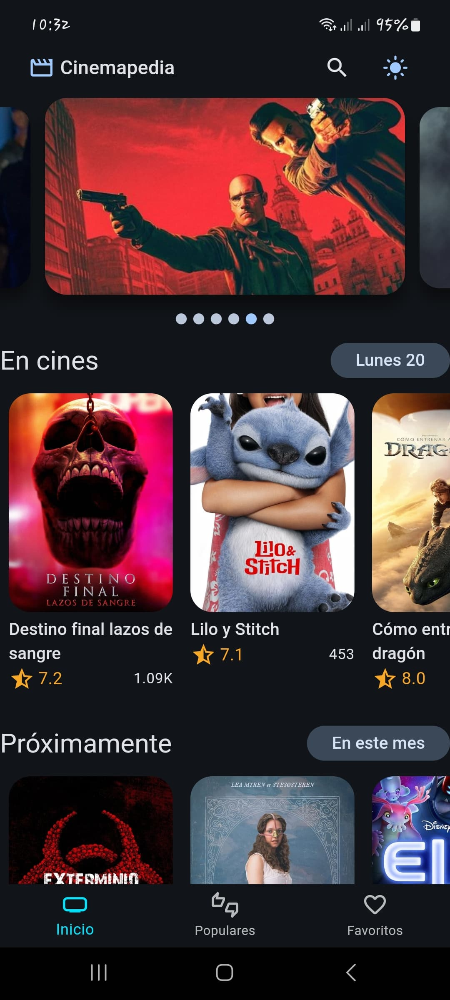
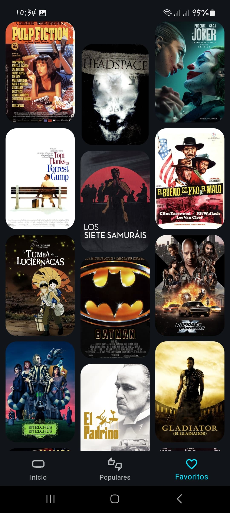

# 🎬 Cinemapedia

Aplicación móvil desarrollada con Flutter que consume la API de TheMovieDB para mostrar películas populares, estrenos, recomendaciones y más.

## 📱 Capturas de pantalla

### Pantalla de inicio

### Búsqueda de película

### Detalle de película

### Películas favoritas

### Películas populares

